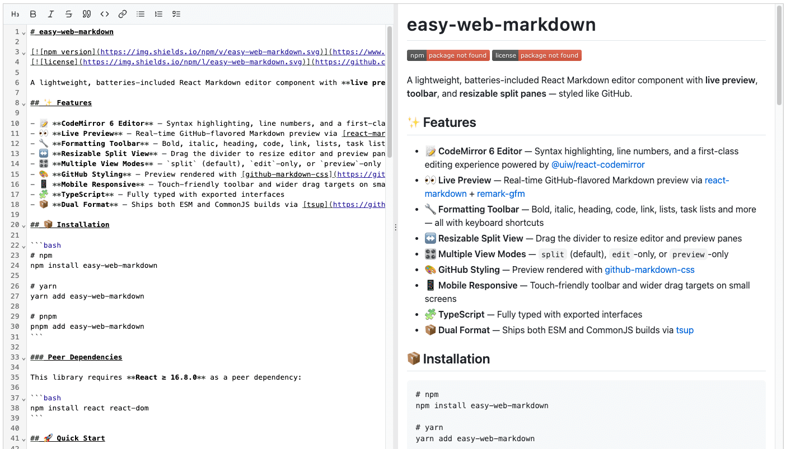

# easy-web-markdown

[](https://www.npmjs.com/package/easy-web-markdown)
[](https://github.com/GlenHoo/easy-web-markdown/blob/main/LICENSE)

A lightweight, batteries-included React Markdown editor component with **live preview**, **toolbar**, and **resizable split panes** — styled like GitHub.

<center>



</center>

## ✨ Features

- 📝 **CodeMirror 6 Editor** — Syntax highlighting, line numbers, and a first-class editing experience powered by [@uiw/react-codemirror](https://github.com/uiwjs/react-codemirror)
- 👀 **Live Preview** — Real-time GitHub-flavored Markdown preview via [react-markdown](https://github.com/remarkjs/react-markdown) + [remark-gfm](https://github.com/remarkjs/remark-gfm)
- 🔧 **Formatting Toolbar** — Bold, italic, heading, code, link, lists, task lists and more — all with keyboard shortcuts
- ↔️ **Resizable Split View** — Drag the divider to resize editor and preview panes
- 🎛️ **Multiple View Modes** — `split` (default), `edit`-only, or `preview`-only
- 🎨 **GitHub Styling** — Preview rendered with [github-markdown-css](https://github.com/sindresorhus/github-markdown-css)
- 📱 **Mobile Responsive** — Touch-friendly toolbar and wider drag targets on small screens
- 🧩 **TypeScript** — Fully typed with exported interfaces
- 📦 **Dual Format** — Ships both ESM and CommonJS builds via [tsup](https://github.com/egoist/tsup)

## 📦 Installation

```bash
# npm
npm install easy-web-markdown

# yarn
yarn add easy-web-markdown

# pnpm
pnpm add easy-web-markdown
```

### Peer Dependencies

This library requires **React ≥ 16.8.0** as a peer dependency:

```bash
npm install react react-dom
```

## 🚀 Quick Start

You'll need to import the component and optionally a CSS theme for the preview pane:

```tsx
import { Markdown } from "easy-web-markdown";

// Option A: Use the built-in minimal theme
import "easy-web-markdown/styles/preview.css";

// Option B: Bring your own theme (e.g., github-markdown-css)
// import "github-markdown-css/github-markdown.css";

function App() {
  return (
    <div style={{ height: 600 }}>
      <Markdown initialValue="# Hello World" onChange={(value) => console.log(value)} />
    </div>
  );
}
```

> **Note:** The `<Markdown />` component fills the height of its parent container. Make sure the parent has an explicit height set.

## 📖 API

### `<Markdown />`

The main component that provides the full editor + preview experience.

| Prop           | Type                             | Default   | Description                             |
| -------------- | -------------------------------- | --------- | --------------------------------------- |
| `initialValue` | `string`                         | `""`      | Initial Markdown content                |
| `onChange`     | `(value: string) => void`        | —         | Callback fired when the content changes |
| `mode`         | `"split" \| "edit" \| "preview"` | `"split"` | View mode for the component             |

#### View Modes

| Mode      | Description                                              |
| --------- | -------------------------------------------------------- |
| `split`   | Side-by-side editor and preview with a draggable divider |
| `edit`    | Editor only                                              |
| `preview` | Read-only rendered preview                               |

## ⌨️ Keyboard Shortcuts

All toolbar actions are accessible via keyboard shortcuts:

| Action         | macOS | Windows / Linux |
| -------------- | ----- | --------------- |
| Heading        | `⌘⇧H` | `Ctrl+Shift+H`  |
| Bold           | `⌘B`  | `Ctrl+B`        |
| Italic         | `⌘I`  | `Ctrl+I`        |
| Strikethrough  | `⌘⇧X` | `Ctrl+Shift+X`  |
| Quote          | `⌘⇧.` | `Ctrl+Shift+.`  |
| Inline Code    | `⌘E`  | `Ctrl+E`        |
| Link           | `⌘K`  | `Ctrl+K`        |
| Unordered List | `⌘⇧8` | `Ctrl+Shift+8`  |
| Ordered List   | `⌘⇧7` | `Ctrl+Shift+7`  |
| Task List      | `⌘⇧L` | `Ctrl+Shift+L`  |

## 🏗️ Development

```bash
# Install dependencies
pnpm install

# Start the playground dev server
pnpm dev

# Build the library
pnpm build

# Run tests
pnpm test

# Type check
pnpm typecheck
```

The `playground/` directory contains a Vite-powered demo app for local development and testing.

## 🛠️ Tech Stack

| Category     | Technology                                                                                                     |
| ------------ | -------------------------------------------------------------------------------------------------------------- |
| Editor       | [CodeMirror 6](https://codemirror.net/) via [@uiw/react-codemirror](https://github.com/uiwjs/react-codemirror) |
| Preview      | [react-markdown](https://github.com/remarkjs/react-markdown)                                                   |
| GFM Support  | [remark-gfm](https://github.com/remarkjs/remark-gfm)                                                           |
| HTML Support | [rehype-raw](https://github.com/rehypejs/rehype-raw)                                                           |
| Styling      | [github-markdown-css](https://github.com/sindresorhus/github-markdown-css)                                     |
| Icons        | [react-icons](https://react-icons.github.io/react-icons/) (Lucide)                                             |
| Bundler      | [tsup](https://github.com/egoist/tsup)                                                                         |
| Dev Server   | [Vite](https://vitejs.dev/)                                                                                    |

## 📄 License

[MIT](./LICENSE)
